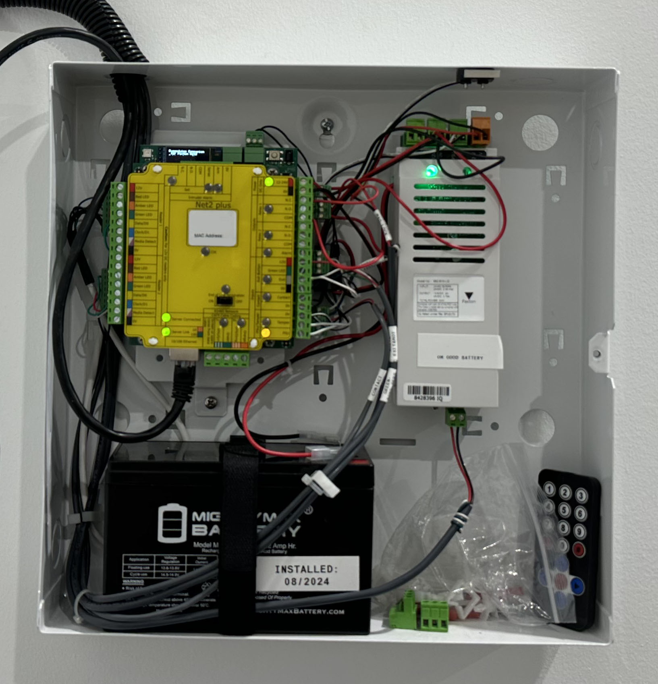
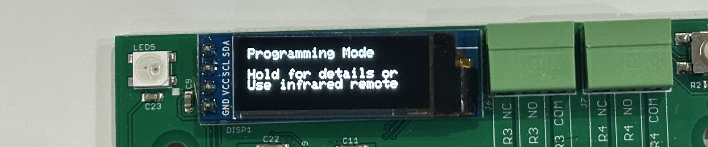

# RuggedPaxCompanion
This is the stock firmware for the Ruggeduino Companion board from Rugged Circuits, which is compatible with the
footprint and protocol of the Paxton Net2 access control system.

Ruggeduino is an Arduino-compatible board whose source code can be edited to suit specific customizations not
available in a default Net2 installation.  Several features are provided in this firmware and can be
enabled by an installer using an infrared remote control.

# What is the board?
The Companion board discreetly installs behind a Paxton Net2 Access Control Unit (ACU), fitting completely inside
the original Paxton cabinet.  The Companion performs additional custom functions
not available in the stock Net2 system.  These functions are of your choosing from this stock firmware image, 
or one that you customized and loaded yourself since the board is 100% compatible with the Arduino IDE development
environment.

Viewed another way, Companion is an Arduino board that can be used to implement a customized security solution,
which supports having a Paxton Net2 Access Control Unit placed on top of it.  This effectively "grafts in" an
industry-leading solution and an established enterprise software/vendor ecosystem that serves as a solid starting point for
your custom door installation.

# Hardware Features of the Ruggeduino Companion board
* Fits perfectly behind a Paxton Net2 ACU in its native enclosure, using standard 1-inch nylon standoffs
* Atmega2560 Arduino-compatible processor
* Overvoltage protection for external-facing pins
* Arduino Shield-compatible connector
* 4 programmable relays
* Current sensor on flow through Relay1
* 128x32 OLED display
* Eye sensor for IR remotes (configurator)
* Supply voltage 6 to 30 volts
* Onboard current-limited 12-volt power supply (1 amp)
* Onboard current-limited 5-volt power supply (1 amp)
* Beeper, RGB status LED, and setup button

# Some Firmware Features

1. Use generic Wiegand-compatible RFID card readers and PIN keypads, with support for variable bit
   lengths (e.g. for HID MultiClass and similar readers) and proper numeric conversion of Paxton-branded
   tokens (so they read the same code as on Paxton readers).
   This firmware emulates the clock-and-data protocol used by Paxton's own card readers and keypads, so,
   you'll simply program them as "Paxton Reader" with "Paxton Tokens".

2. Multiple relay outs.  Switch multiple loads (up to 4 relays) when access is granted.

3. Current (amperage) sensor, as a way of detecting lock status.  Can be used to drive a relay out and
   inform a security system.

4. Motion detector timing program.  *Avoids* allowing the motion detector to unlock the door for the
   first 20 seconds of being closed, so it locks immediately upon closure and allows the person
   closing the door to verify it's closed, without the motion detector immediately unlocking it as they
   try to walk away.

6. Door-left-open warning beep (for RFID keypads with a beep function)

7. Two door contact inputs, and logic for handling double-doors (i.e. single doors that have two slabs)

8. Use any regular dry-contact doorbell switch to transmit the "doorbell pressed" message to the Paxton Net2 ACU.

9. The ability to use the free Arduino IDE software to make modifications to the firmware (or create your own) with
    intermediate-level Arduino programming experience

Other features in the concept and development stage include support for a privacy toggle switch (to allow occupants
to select a mode where card swipes go to the Reader 2 port, separately configurable in Paxton to have different
access rules), and a serial logger/uplink connection to enable more options for integration with a security/alarm system.

# Installing in a Paxton ACU cabinet

1. Open your Paxton cabinet.  You'll find the Paxton ACU board attaches to the cabinet via a mounting plate
   and four plastic snap-in standoffs.  Remove the mounting plate (held in by a screw), and then remove these
   standoffs from the ACU board and the mounting plate (which may require carefully squeezing them with needle-nose pliers).
   These standoffs will not be needed and can either be saved or discarded.

2. Attach the four supplied *brass* #6-32 standoffs to the mounting plate (where you removed the original standoffs), and secure these in place with the
   metal nuts provided.  The nuts go on the back side, facing the wall, so the threaded side faces you when the mounting
   plate goes back into the cabinet.

3. Re-attach the mounting plate into the Paxton cabinet.

4. Hold the Companion board onto the mounting plate, lining up the holes in the Companion board with the brass
   standoffs.

5. Use the four *white plastic* standoffs (provided) to mount the Companion board into the enclosure.
   Finger tighten.

6. Use the four screws to attach the ACU board onto the plastic standoffs, so that it overlays the Companion board.

7. Ensure correct fit, and that the cabinet door still closes with the additional circuit board installed.

8. Wire the power supply (12 volts) into the top right corner (2-position) connector of the Companion board,
   observing correct polarity.  Any other things you wire to the Companion board will depend on your choice of enabled features.

# Setup

This firmware is designed to be useful on a board that is sold pre-flashed and packaged with an infrared remote
for a typical install and configuration.  The board has a single button for navigating through a basic menu screen.

Press the button to flip through the main pages: Info, Diagnostics, and Programming.

Navigating through the pages is done via either short presses or long presses.
In general, a long press will either make a selection or drill down into detail, and short
presses will step through things.  Without an infrared remote to use as a keypad,
you are limited to view-only access.

In "programming mode", an infrared remote can be used to enable and configure the built-in
features.  The common generic remote provided in Arduino hobby kits on Amazon is natively
supported, and the firmware's quick-learn feature allows the board to learn a new remote, borrowed
from some other appliance (such as a television), in case you do not
have one of these handy.  (Press 0 on that remote, ten times, in programming mode, to start the
learning process, and then follow on-screen instructions.  If nothing happens, the remote isn't compatible)

As implemented, each feature is enabled or disabled by entering an 8-digit number, consisting
of a 5-digit feature code, and then 3-digits to enable, disable, or configure the feature.
Type the number and press the enter or # key on the remote.  The 5-digit feature code is influenced
by what digits would spell the name of the feature if it were a touch-tone keypad.

On the remote, the star or back key erases your input (or any messages) and allows you to enter another
feature code.  Feature codes are saved immediately but will take effect after the board is
rebooted or reset.  For convenience, pressing the configuration button after entering any valid feature
codes will immediately reboot the board.

# Normal operation

During normal operation, the OLED screen remains blank, and the multi-color LED will briefly
flash green, once per second.  Keeping the OLED screen blank preserves its lifespan and
avoids screen burn-in.  Press the configuration button (to its right) to wake it up and
see information about the board.

The board does not react to the IR remote unless it is placed programming mode using the
configuration button.  This is
in case you have a single cabinet with multiple boards (e.g. Altronix Trove for Paxton Net2)
that would all react to the IR remote if it weren't this way.

# Compiling
Compile this sketch for Arduino Mega 2560.  It has the following library dependencies:
* Adafruit NeoPixel
* Adafruit SSD1306

# Connecting things

## Wiegand RFID card reader
A Wiegand card reader connects to the top-left 8-terminal port (J3), as follows (from top to bottom):
* +12V
* Wiegand Data D0 (GPIO18)
* Wiegand Data D1 (GPIO19)
* LED (GPIO12)
* Beep (GPIO11)
* Bell button (A8)
* N/C or 2nd bell button wire (A9)
* GND

If your reader doesn't have a feature, or a wire for a feature, then leave the terminal unconnected.  If your reader has
a wire that selects 26 or 34 bit Wiegand, this wire should be tied with the ground wire, and both connected
to GND (we always want to receive the largest possible bit count).

Use the bottom-left 8-terminal port (J4) to connect to the Paxton Net2 module, as follows:
* N/C (Do not connect +12V to Paxton)
* Paxton D0/Data
* Paxton D1/Clock
* Paxton Red LED Connection
* N/C
* N/C
* N/C
* Paxton Ground

The programming code to enable this feature is 87267114.  To disable it, 87267000.

The RFID reader is assumed to show a green light when the LED wire is set low (or grounded), and red if it's
set high or disconnected.  For HID MultiClass readers, the terminal labeled "GRN" or "GREEN" has this behavior.

The reader is assumed to beep when the beep wire is set low (or grounded).  The reader
translation program will attempt to set the reader light to green any time the Paxton Red LED wire is not being
signaled (which usually coincides with relay time for "access granted" -- or a rapid sequence of flashes for
"access denied").

## Doorbell button
The Paxton Net2 system supports a doorbell button (which is present on their PIN keypads).  The doorbell button
is transmitted like a keypress, over the same clock/data wire as the card swipes and key presses.

The programming code 32355008 enables the pins A8+A9 (or A8+GND) to be a contact closure doorbell connection.
When enabled, the board will transmit a doorbell keypress message to the Paxton ACU when the
contacts become closed.

Sometimes Wiegand RFID keypads provide a doorbell button -- and if there are two doorbell wires in the
wiring harness, then it's a good indication that it is just a dry contact switch.

## Door contact
Connect to A15 and GND on the lower right side of the board (J12).

If it's a double door and you have a separate door contact for each door slab,
use A15 for one door, and A14 for the other door.  The double door detection
allows for a subtle behavioral difference in the motion detecting and lock cutoff logic when someone
opens only one slab of the door and then closes it shortly afterward.

The selection of a "door program" enables the behavior of detecting whether the door(s) are
closed, and drives the timer that decides whether to allow the motion detector to cut power to the lock (via Relay 1).

The programming code to enable door contact sensing is:
* 36667010 = Single Door, Sense Closed When Sense_A (A15) Input Grounded, Sense Locked via Current Detection
* 36667011 = Single Door, Sense (Not Closed) Open When Sense_A Input Grounded, Sense Locked via Current Detection
* 36667012 = Double Door, Sense A&B (A15&A14), Door is Closed when Input Grounded, Report Locked via Current Detection
* 36667013 = Double Door, Sense A&B, Door is Open when Input Grounded, Report Locked via Current Detection
* 36667014 = Single Door, Sense Closed when Sense_A Grounded, Sense Locked when Sense_B Input Grounded 
* 36667015 = Single Door, Sense Closed when Sense_A Not Grounded, Sense Locked when Sense_B Input Not Grounded

When the board "senses" the door is closed or locked, this status information can be routed
elsewhere.  For example, you can configure any of the relays to energize whenever "the door is closed".

## Motion detector
Connect to middle right side of the board (J10).  +12V and GND are provided for powering
the motion detector.  The motion detector relay should connect GPIO16 to either ground or GPIO17
when motion is detected.

The motion detector program doesn't require a feature code -- it's active any time a door program
is active, or a relay program that references the motion detector.  The feature code
that ties relay 1 to the motion detector is 00101035.

The motion detector program will prevent the motion detector from cutting power to the lock
for the first 20 seconds after a door is closed.  This is so a person closing the door 
doesn't inadvertently unlock the door again just by walking near it.

If you're connecting the motion detector to the Companion board and using it to cut lock
power, there is no longer any reason to wire the motion detector to (for example) the Exit Button
input on the Paxton board.

## Door lock connection
If your lock is "locked while powered", then it is ideal to route the power through *both*
the Paxton Net2 ACU's Relay 1, and the Ruggeduino Companion's Relay 1, both on the normally
closed side, so that either board may unlock the door.  The Paxton will be responsible for
unlocking the door when access is granted, and the Companion will be responsible for unlocking
the door when motion is detected.

Connect the lock power to go through to Relay 1 (J8).  Using the "normally closed" connection,
the motion detector and door program will energize this relay to cut power to the lock when
motion is detected under the appropriate conditions.

## Relay program
This feature allows you to configure any of the 4 onboard relays to mirror some sensed
status on board.

Feature codes (replace x with the relay number, 1-4)
* 0010x000 = Relay not configured
* 0010x112 = Relay energized when input A12 (right side of board, J11) is grounded.  Useful for mirroring the Paxton relay(s) to more relays.
* 0010x020 = Relay energized when the board believes the door is locked based on current sensing (requires option 02877xxx on)
* 0010x035 = Relay energized when motion detected *and* door closed for over 20 seconds
* 0010x036 = Relay energized when door is sensed as closed (for two door setup, both must be closed)
* 0010x037 = Relay energized when door is sensed as locked (based on configuration for sensing lock status)
* 0010x038 = Relay energized when motion detected
* 0010x008 = Relay energized when Arduino shield pin 8 is connected to ground

## Current sensing
This feature is preliminary, because at the present time, some default parameters have been
programmed to sense the proper current levels for locks used in testing, with the expectation
that code customization might be required to adapt the programming for different types of
locks.  That said, the feature code 02877091 turns current sensing on, and 02877000 turns it
off.

An expansion of this section would probably look like different versions of 02877xxx feature
codes to target different models of locks or levels of current.  A notable possibility
is being able to detect whether the lock is jammed by analysis of its current consumption
(e.g. a lock that failing to engage with the door due to incomplete closure or poor alignment).

# Reset button
The small button near the middle of the board is a reset button.  The board will also reset
if the top (configuration) button is held for about 8 seconds.

